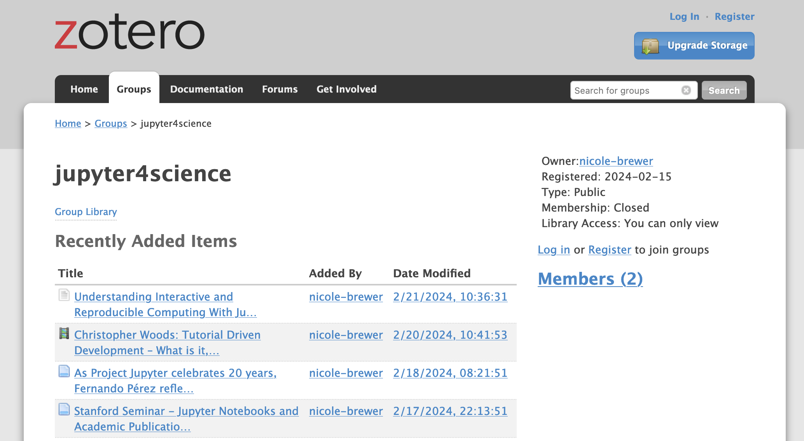

## What is a Zotero Group Collection?

[Zotero](https://www.zotero.org/) is a free, easy-to-use tool to help you collect, organize, cite, and share research. A **Collection** is a specific feature within Zotero that allows users to organize their references into folders. [**Groups**](https://www.zotero.org/support/groups) provide a powerful way to collaborative curate and share collections. 

## Accessing jupyter4science group collection

There are two ways to access the collection. 

1. Visit the [Zotero group page](https://www.zotero.org/groups/5403897/jupyter4science) to view and download items from the collection.
2. Access the collection via [CiteSphere](https://chps.asu.edu/citesphere/). CiteSphere is a web application that sits on top of Zotero and provides additional features such as allowing users to specify affiliation data for authors.

## Contribute to the jupyter4science collection

Have a resource in mind that would be a great addition to our library? We'd love to hear from you! While only members can directly add resources to the Zotero collection, we welcome suggestions from everyone.

Please fill out this [Google Form](#) (Note: replace `#` with the actual link to your form) to suggest resources. If you are in a pinch for time, simply give us a list of DOIs. However we also encourage you to include as much information as possible about the resource and why it's valuable to the jupyter4science audience. Our team will review your suggestion and, if it aligns with our criteria, add it to the collection.
### Become a member of the jupyter4science group

Interested in becoming a more active member of our community? We're always looking for passionate individuals to help curate our library. By becoming a member, you'll gain the ability to directly add and manage resources in our Zotero collection. There is a place in the [Google Form](#) to indicate your interest.